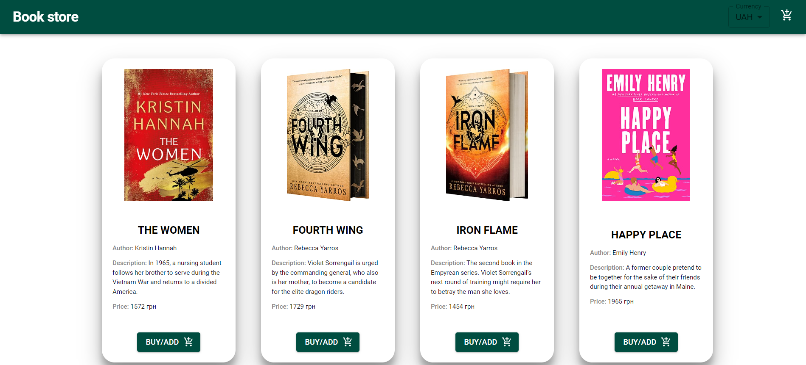
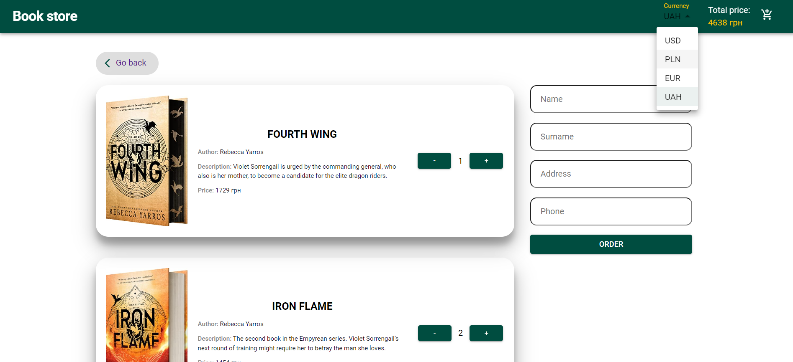

# Simple Book Store Application

This is a simple book store application built using React.js and Redux. Users can browse through a list of books, add them to their cart, and order books. Along with fundamental functionalities, the app incorporates advanced features such as retrieving product data from Firebase, dynamic pricing, and currency selection to enhance user experience.

## Technologies Used

- React.js
- TypeScript
- Redux (toolkit, redux-persist)
- Firebase
- Material-UI
- React Router
- Styled-components
- Formik/Yup

## Features

- Displays a list of books stored in a JSON object from Firebase.
- Users can add books to their cart by clicking the "Buy/Add" button.
- Total price is displayed in the header near the basket icon.
- Dynamically update the total price when adding or removing items from the cart.
- Remove items from the cart if the quantity is reduced to zero.
- Persist cart items even after page reload using local storage.
- Store JSON in Firebase collection with ordered goods and user information.
- Implemented currency selector to allow users to change the currency.





<video src='./public/ImagesForReadme/video-presentation.mp4' width=180></video>

## How to Use

### Cloning the Repository

1. Clone the repository from GitHub using the following command:

```bash
  git clone https://github.com/KatiaOcheretiana/book-store
```

### Installing Dependencies

2. Navigate to the project directory:

```bash
 cd book-store
```

3. Install dependencies using yarn:

```bash
yarn add
```

### Starting the Application

4. Once the dependencies are installed, start the application using:

```bash
yarn start
```

5. The application will start running locally, and you can access it via your web browser at `http://localhost:3000`.
